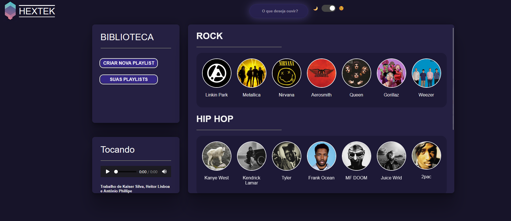

# HEXTEK

Sistema web em desenvolvimento de reprodução de música com interface interativa.

## Funcionalidades
- Player de música
- Pesquisa de artistas
- Interface responsiva
- Tema claro/escuro

## Tecnologias
- HTML
- CSS
- JavaScript

## Como usar
1. Baixe o projeto
2. extraia os arquivos
3. Abra e execute o arquivo `Home.html`

## Preview

